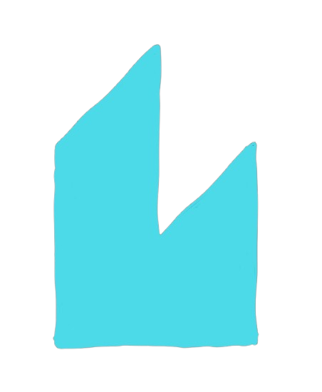

<p align="center">
  
</p>

<div align="center">
  
[Live Demo](https://dim.positive-intentions.com)
</div>

<div align="center">
  
 
 
 
 
 
[](https://github.com/positive-intentions/dim/actions/workflows/pages/pages-build-deployment)
[](https://github.com/positive-intentions/dim/actions/workflows/codeql.yml)

</div>

# Dim

a thin wrapper around lit-elements to create functional webcomponents.

this is early development on this and it’s missing all the bells-and-whistles needed in a proper app. It’s an unstable experimental work-in-progress. it may contain bugs and/or incomplete features. provided for demo and educational purposes only. nobody should be using this in production.

## Example

```javascript
import {
  useState,
  useEffect,
  useMemo,
  useStyle,
  useScope,
  useStore,
  html,
  css,
} from "./dim.ts";

const Button = function ({ children, initialstate = 0 }) {
  const [count, setCount] = useState(parseInt(initialstate), "test-state");

  useStyle(css`
    button {
      background-color: #4caf50;
      border: none;
      color: white;
      padding: 15px 32px;
      text-align: center;
      text-decoration: none;
      display: inline-block;
      font-size: 16px;
      margin: 4px 2px;
      cursor: pointer;
    }
  `);

  useScope({
    // 'dim-span': DimSpan
  });

  useEffect(() => {
    console.log("Button mounted");
    return () => {
      console.log("Button unmounted");
    };
  }, []);

  useEffect(() => {
    console.log("count effect triggered");
  }, [count]);

  const someCalculation = useMemo(() => {
    const result = count() * 2;
    console.log("memo calculation triggered:", result);
    return result;
  }, [count]);

  const {
    settings: {
      username: [username, setUsername],
    },
    config: {
      button: {
        label: [label, setLabel],
      },
    },
  } = useStore({
    settings: {
      username: true,
    },
    config: {
      button: {
        label: true,
      },
    },
  });

  return html`
    <button @click="${() => setCount(count() + 1)}">
      ${children} ${count()} ${someCalculation}
    </button>
  `;
};

export default Button;
```

