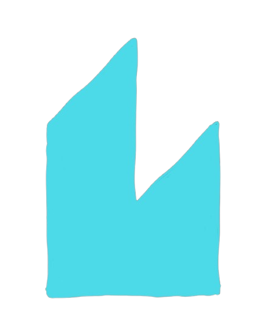

<p align="center">
  
</p>

<h1 align="center">Dim Framework</h1>

<p align="center">
  <strong>A React-inspired functional web components framework</strong>
</p>

<p align="center">
  Build modern web applications with familiar React-like syntax, powered by native Web Components
</p>

<div align="center">
  
[**Live Demo & Documentation**](https://dim.positive-intentions.com) | [**Getting Started**](#getting-started) | [**Examples**](#examples) | [**API Reference**](#api-reference)

</div>

<div align="center">
  
 
 
 

 
[](https://github.com/positive-intentions/dim/actions/workflows/pages/pages-build-deployment)
[](https://github.com/positive-intentions/dim/actions/workflows/codeql.yml)


</div>

---

## 🌟 Overview

Dim is a lightweight framework that brings React's component model and hooks to native Web Components. Write familiar functional components with hooks while leveraging the power of web standards.

> **⚠️ Experimental**: This framework is in early development and is not production-ready. It's provided for educational and experimental purposes.

## ✨ Features

- 🎯 **React-like DX** - Familiar hooks API (`useState`, `useEffect`, `useMemo`, etc.)
- 🔧 **Web Standards** - Built on native Web Components and Shadow DOM
- 🎨 **Scoped Styling** - CSS-in-JS with automatic style isolation
- 📦 **Zero Dependencies** - Pure JavaScript, no build step required
- 🚀 **Lightweight** - Minimal overhead on top of native APIs
- 💾 **State Persistence** - Built-in global state management with `useStore`

## 🚀 Getting Started

### Quick Example

```javascript
import { html, css, define, useState, useStyle } from '@dim/core';

// Create a component
const Counter = (props, { useState, html, css, useStyle }) => {
  const [count, setCount] = useState(0);
  
  useStyle(css`
    .counter {
      padding: 2rem;
      text-align: center;
    }
    
    button {
      background: #029cfd;
      color: white;
      border: none;
      padding: 0.5rem 1rem;
      border-radius: 4px;
      cursor: pointer;
    }
  `);
  
  return html`
    <div class="counter">
      <h2>Count: ${count}</h2>
      <button @click="${() => setCount(count + 1)}">
        Increment
      </button>
    </div>
  `;
};

// Register as custom element
define({ tag: 'my-counter', component: Counter });

// Use it
// <my-counter></my-counter>
```

## 📚 Core Concepts

### Hooks

Dim provides React-like hooks for managing component logic:

#### `useState` - Local State Management
```javascript
const [value, setValue] = useState(initialValue);
```

#### `useEffect` - Side Effects
```javascript
useEffect(() => {
  // Effect logic
  return () => {
    // Cleanup
  };
}, [dependencies]);
```

#### `useStyle` - Scoped CSS
```javascript
useStyle(css`
  .my-class {
    color: blue;
  }
`);
```

#### `useScope` - Component Composition
```javascript
useScope({
  'child-component': ChildComponent
});
```

#### `useMemo` - Memoized Values
```javascript
const expensive = useMemo(() => {
  return computeExpensive(value);
}, [value]);
```

#### `useRef` - DOM References
```javascript
const inputRef = useRef();
// Access via inputRef.current
```

#### `useStore` - Global State
```javascript
const { user: [user, setUser] } = useStore({
  user: { name: 'John' }
});
```

## 💡 Examples

### Todo List
```javascript
const TodoList = (props, { useState, html, css, useStyle }) => {
  const [todos, setTodos] = useState([]);
  const [input, setInput] = useState('');
  
  const addTodo = () => {
    if (input.trim()) {
      setTodos([...todos, { 
        id: Date.now(), 
        text: input, 
        done: false 
      }]);
      setInput('');
    }
  };
  
  return html`
    <div>
      <input 
        .value="${input}"
        @input="${(e) => setInput(e.target.value)}"
        @keydown="${(e) => e.key === 'Enter' && addTodo()}"
      />
      <button @click="${addTodo}">Add</button>
      
      <ul>
        ${todos.map(todo => html`
          <li class="${todo.done ? 'done' : ''}">
            <input 
              type="checkbox"
              .checked="${todo.done}"
              @change="${() => toggleTodo(todo.id)}"
            />
            ${todo.text}
          </li>
        `)}
      </ul>
    </div>
  `;
};
```

## 📖 Documentation

The framework includes comprehensive documentation through Storybook:

### Main Sections

1. **Getting Started** - Introduction and quick start guide
2. **Core Concepts** - Deep dive into hooks and component architecture
3. **Tutorial** - Step-by-step guide to building applications
4. **Examples** - Real-world patterns and implementations
5. **API Reference** - Detailed documentation for each hook

### Hook Categories

- **State Management**: `useState`, `useStore`
- **Effects & Lifecycle**: `useEffect`, `useRef`
- **Performance**: `useMemo`
- **Styling**: `useStyle`
- **Composition**: `useScope`

Visit the [live documentation](https://dim.positive-intentions.com) for interactive examples and detailed guides.

## 🛠️ Development

### Setup
```bash
# Clone the repository
git clone https://github.com/positive-intentions/dim.git

# Install dependencies
npm install

# Start Storybook dev server
npm run storybook

# Build for production
npm run build
```

### Project Structure
```
dim/
├── src/
│   ├── core/
│   │   ├── dim.ts          # Main framework code
│   │   ├── mini-lit.js     # Lit wrapper
│   │   └── storage-manager.js
│   └── stories/
│       ├── *.stories.js    # Main documentation
│       ├── hooks/          # Hook examples
│       ├── advanced/       # Advanced patterns
│       └── tutorial/       # Step-by-step guides
├── public/
└── README.md
```

## ⚖️ License

This project is licensed under the GNU General Public License v3.0 (GPL-3.0) - see the [LICENSE](LICENSE) file for details. This means you are free to use, modify, and distribute this software, but any derivative works must also be licensed under GPL-3.0.

## 🙏 Acknowledgments

- Inspired by React's component model and hooks
- Built on top of [Lit](https://lit.dev/) for reactive Web Components
- Community feedback

---

<p align="center">
  Dim is brought to you by <a href="https://positive-intentions.com">positive-intentions</a>. Built with positivity.
</p>